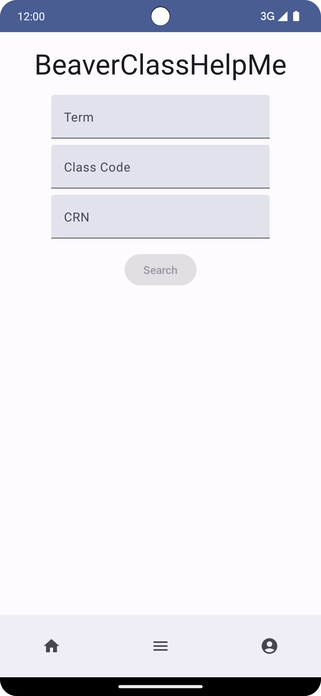

[![MIT License][license-shield]][license-url]
[![LinkedIn][linkedin-shield]][linkedin-url]

# Beaver Class

<p align="center">
  
</p>


<!-- Project Overview -->

## Project Overview
This Android application is designed to streamline class registration at Oregon State University. It allows students to search classes before the registration timeline and notify them once it opens. This is a final project submitted by the contributors to CS 599 Android Development. The application features user interactivity on the front end and utilizes backend API endpoints to manage class registrations.

<!-- Table of Contents -->

## Table of Contents
* [Features](#features)
* [Built With](#built-with)
* [Architecture](#architecture)
* [Setup and Installation](#setup-and-installation)
* [License](#license)

<!-- Features -->

## Features
* **Course Browsing and Management**: Enables users to browse available courses and manage their enrollments.
* **Detailed Course Views**: Each course can be tapped on for more detailed information, including schedules, materials, and instructor notes.
* **User Authentication**: Secure login and registration functionality for maintaining user profiles.
* **Notifications**: Integrated notifications for course updates and reminders.
* **Draft and Manage Emails**: Supports drafting with Google Gemini AI and sending emails, enabling efficient communication within the app.

<!-- Built With -->

## Built With
### Front-end
- [![Android][Android]][Android-url]
- [![Kotlin][Kotlin]][Kotlin-url]
- **Jetpack Compose**
- **Libraries**
  - Retrofit 
  - Room 
  - LiveData and ViewModel 
  
### Back-end
- [![JavaScript][JavaScript]][JavaScript-url]
- [![Node.js][Node.js]][Node-url]
- [![Express.js][Express.js]][Express-url]
- [![Firebase][Firebase]][Firebase-url]
- [![Supabase][Supabase]][Supabase-url]
- [![Gemini][Gemini]][Gemini-url]


<!-- Architecture and User Interface -->

## Architecture
The application adopts the Model-View-ViewModel (MVVM) architectural pattern, facilitating a robust separation of concerns and enhancing the maintainability and scalability of the codebase.

### Data Layer
The data layer manages all data interactions within the application, encompassing both local data persistence using Room and external API communications via Retrofit. This layer abstracts the sources of data and provides a robust API for the upper layers, facilitating data retrieval and manipulation efficiently.

### Domain Layer
The domain layer handles the app’s core logic using ViewModel components, which transfer data from the backend to the user interface. These ViewModels ensure that changes in the display do not affect the app's main operations, maintaining clear organization and ease of management.

### UI Layer
The UI layer is developed entirely using Jetpack Compose, Google's modern toolkit for building native UIs with a declarative approach. This layer consists of various composable functions that encapsulate different user interface parts, such as displaying lists of courses, handling user inputs, and visualizing data. Navigation is managed using Jetpack Compose's Navigation component, which simplifies moving between composables within the app.

<!-- Setup and Installation -->

## Setup and Installation

1. **Clone the repository:**
   ```sh
   git clone https://github.com/yourusername/BeaverClass-.git
   ```
2. Open the project in Android Studio
4. Build the project
    - Navigate to `Build -> Rebuild Project`
5. Run the application:
    - Use an Android emulator or real device to run the application

**Note**: This setup is only for Android configuration. You need to run the back-end part as well for the whole application to work.

For Back-end configurations, follow the steps from my another [project](https://github.com/kaungmyathtaywin/Tarpaulin).

<!-- License -->

## License
This project is licensed under the MIT license. See LICENSE.txt for more information.


<!-- MARKDOWN LINKS & IMAGES -->
<!-- https://www.markdownguide.org/basic-syntax/#reference-style-links -->

[license-shield]: https://img.shields.io/github/license/othneildrew/Best-README-Template.svg?style=for-the-badge
[license-url]: https://github.com/othneildrew/Best-README-Template/blob/master/LICENSE.txt

[linkedin-shield]: https://img.shields.io/badge/-LinkedIn-black.svg?style=for-the-badge&logo=linkedin&colorB=555
[linkedin-url]: https://www.linkedin.com/in/kaung-myat-htay-win-258ab9251/

[JavaScript]: https://img.shields.io/badge/javascript-%23F0D91C?style=for-the-badge&logo=javascript&logoColor=white&logoSize=auto
[JavaScript-url]: https://developer.mozilla.org/en-US/docs/Web/JavaScript

[Node.js]: https://img.shields.io/badge/node.js-green?style=for-the-badge&logo=nodedotjs&logoColor=white&logoSize=auto
[Node-url]: https://nodejs.org/en

[Express.js]: https://img.shields.io/badge/express.js-000000?style=for-the-badge&logo=express&logoColor=white&logoSize=auto
[Express-url]: https://expressjs.com/

[Kotlin]: https://img.shields.io/badge/kotlin-%23C21EF0?style=for-the-badge&logo=kotlin&logoColor=white&logoSize=auto
[Kotlin-url]: https://kotlinlang.org/

[Android]: https://img.shields.io/badge/android-%233BD682?style=for-the-badge&logo=android&logoColor=white&logoSize=auto
[Android-url]: https://www.android.com/

[Supabase]: https://img.shields.io/badge/supabase-%233CC88C?style=for-the-badge&logo=supabase&logoColor=white&logoSize=auto
[Supabase-url]: https://supabase.com/

[Gemini]: https://img.shields.io/badge/googlegemini-%23066DF8?style=for-the-badge&logo=googlegemini&logoColor=white&logoSize=auto
[Gemini-url]: https://gemini.google.com/

[Firebase]: https://img.shields.io/badge/firebase-%23F8C62B?style=for-the-badge&logo=firebase&logoColor=white&logoSize=auto
[Firebase-url]: https://firebase.google.com/